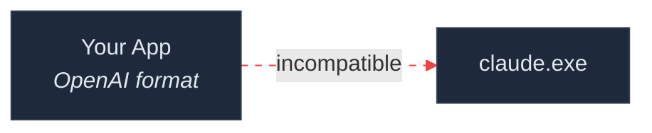
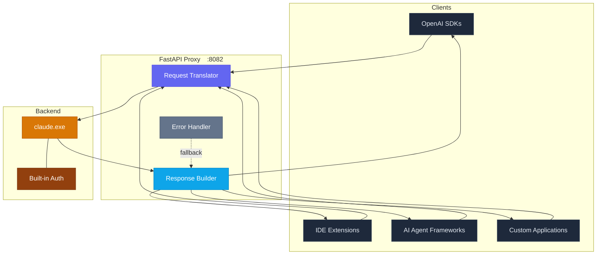
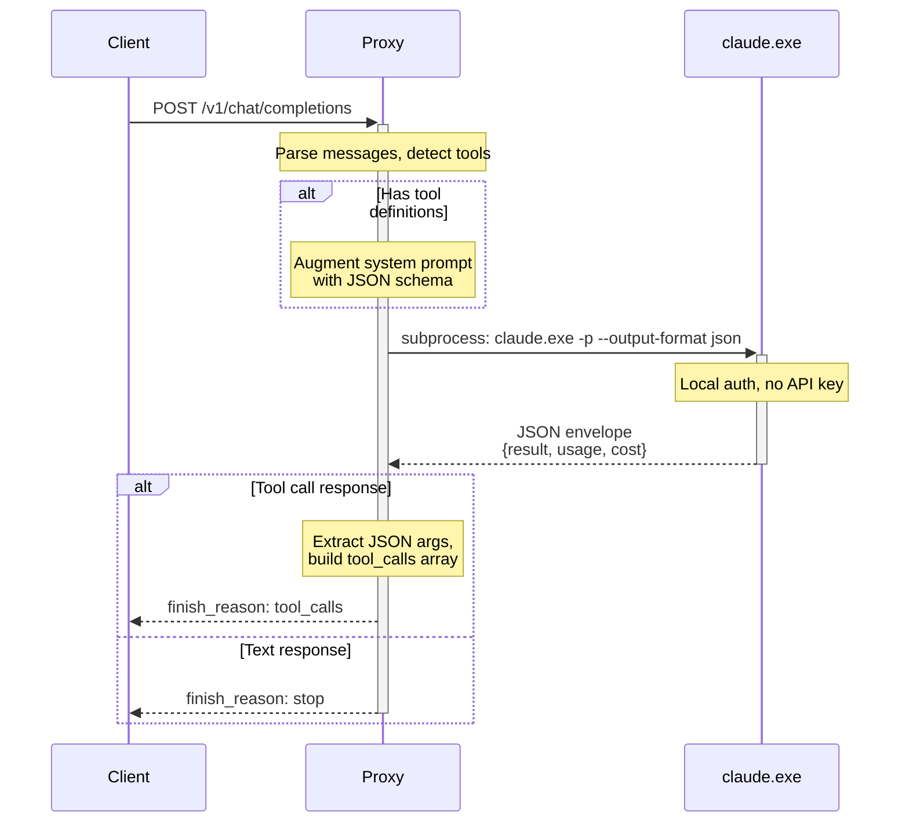
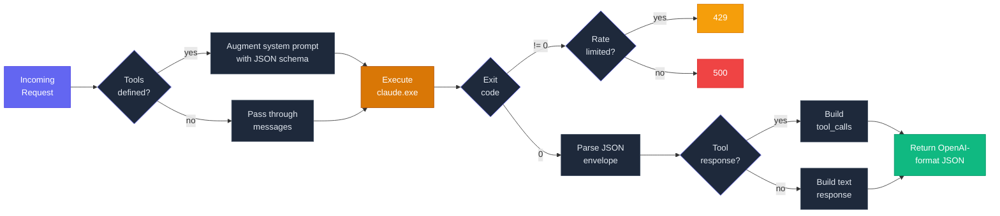
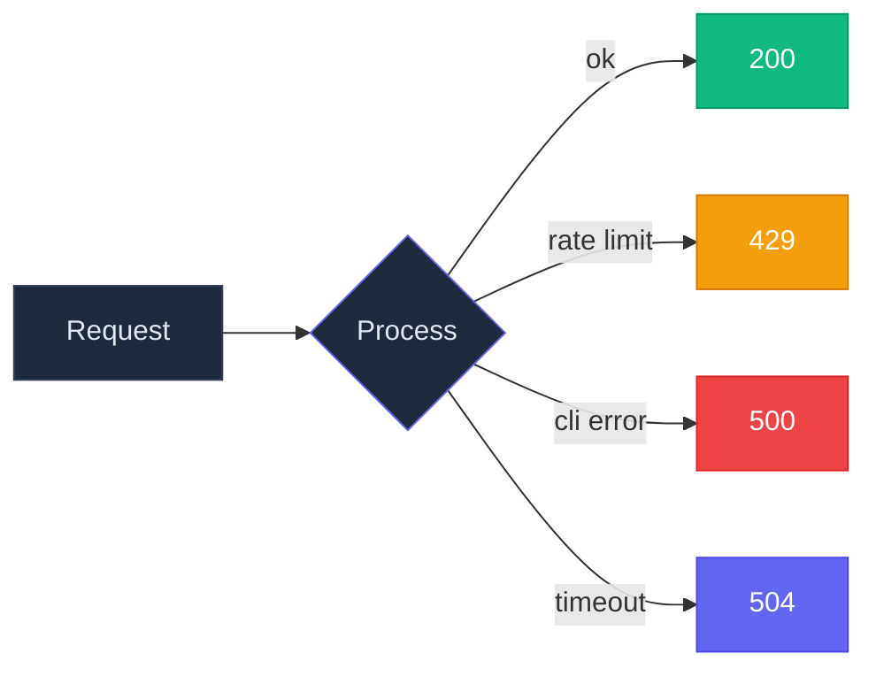

<p align="center">
  <picture>
    <source media="(prefers-color-scheme: dark)" srcset="https://img.shields.io/badge/%E2%9C%A6_Claude_CLI_%E2%86%92_OpenAI_Proxy-6366f1?style=for-the-badge&labelColor=1e1b4b">
    
  </picture>
</p>

<p align="center">
  <strong>A lightweight FastAPI bridge that lets any OpenAI-compatible client<br>talk to your local Claude CLI — zero API keys required.</strong>
</p>

<p align="center">
  
  
  
  
  
</p>

<p align="center">
  <a href="#why-this-exists">Why</a>&ensp;&bull;&ensp;<a href="#architecture">Architecture</a>&ensp;&bull;&ensp;<a href="#quick-start">Quick Start</a>&ensp;&bull;&ensp;<a href="#api-reference">API</a>&ensp;&bull;&ensp;<a href="#client-examples">Clients</a>&ensp;&bull;&ensp;<a href="#configuration">Config</a>
</p>

---

## Why This Exists

<table>
<tr>
<td width="50%" valign="top">

**The problem**

Your tools, SDKs, and IDE extensions speak **OpenAI**. Claude CLI speaks its own protocol. Without a translation layer, they can't communicate.



</td>
<td width="50%" valign="top">

**The solution**

This proxy sits between them — accepts OpenAI-format requests, calls your local `claude.exe`, and returns OpenAI-format responses. Drop-in, transparent.


</td>
</tr>
</table>

---

## Architecture



---

## Request Lifecycle

A complete trace of how a single request flows through the system:



---

## Processing Pipeline



---

## Key Features

<table>
<tr>
<td align="center" width="25%">

**OpenAI Compatible**

Drop-in replacement for any client that speaks the OpenAI API format — SDKs, agents, IDE plugins.

</td>
<td align="center" width="25%">

**Tool Calling**

Full function-calling support via schema-augmented system prompts. Returns proper `tool_calls` responses.

</td>
<td align="center" width="25%">

**Zero API Keys**

Uses Claude CLI's built-in auth. No Anthropic API key needed for the proxy.

</td>
<td align="center" width="25%">

**Production Ready**

Async FastAPI, configurable timeouts, rate-limit detection, and structured error handling.

</td>
</tr>
</table>

---

## Quick Start

### Prerequisites

| Requirement | Version | Purpose |
|:--|:--|:--|
| Python | `3.9+` (recommended `3.11`) | Runtime |
| Claude CLI | Latest | AI backend — [`claude.exe`](https://docs.anthropic.com/en/docs/claude-cli) |
| pip | Any | Dependency installation |

### Install

```bash
git clone https://github.com/MohammadAsadolahi/Claude-CLI-OpenAI-Proxy.git
cd Claude-CLI-OpenAI-Proxy

python -m venv .venv
.venv\Scripts\activate            # Linux/Mac: source .venv/bin/activate
pip install -r requirements.txt
```

### Run

```bash
python server.py
```

### Verify

```bash
curl http://127.0.0.1:8082/health
```

```json
{ "status": "ok", "model": "haiku", "effort": "max" }
```

---

## Configuration

All settings use environment variables with sensible defaults.

| Variable | Default | Description |
|:--|:--|:--|
| `CLAUDE_PATH` | `C:\Users\AG\.local\bin\claude.exe` | Path to Claude CLI binary |
| `CLAUDE_MODEL` | `haiku` | Model alias — `haiku`, `sonnet`, or `opus` |
| `CLAUDE_EFFORT` | `max` | Thinking effort — `min` `low` `balanced` `high` `max` |
| `PORT` | `8082` | HTTP listen port |
| `CLAUDE_TIMEOUT` | `300` | Per-request timeout in seconds |

<details>
<summary>PowerShell example</summary>

```powershell
$env:CLAUDE_PATH   = 'C:\Users\AG\.local\bin\claude.exe'
$env:CLAUDE_MODEL  = 'sonnet'
$env:CLAUDE_EFFORT = 'max'
$env:PORT          = '8082'
python server.py
```

</details>

<details>
<summary>Bash example</summary>

```bash
export CLAUDE_PATH="/usr/local/bin/claude"
export CLAUDE_MODEL="sonnet"
export CLAUDE_EFFORT="max"
export PORT="8082"
python server.py
```

</details>

---

## API Reference

| Method | Endpoint | Description |
|:--|:--|:--|
| `POST` | `/v1/chat/completions` | Chat completions and tool calls |
| `GET` | `/v1/models` | List available models |
| `GET` | `/health` | Health check with config info |

### `POST /v1/chat/completions`

<details open>
<summary><strong>Text completion</strong></summary>

```bash
curl -X POST http://127.0.0.1:8082/v1/chat/completions \
  -H 'Content-Type: application/json' \
  -d '{
    "messages": [
      {"role": "system", "content": "You are a helpful assistant."},
      {"role": "user", "content": "What is the capital of France?"}
    ]
  }'
```

```json
{
  "id": "chatcmpl-a1b2c3d4e5f6",
  "object": "chat.completion",
  "created": 1700000000,
  "model": "haiku",
  "choices": [{
    "index": 0,
    "message": { "role": "assistant", "content": "The capital of France is Paris." },
    "finish_reason": "stop"
  }],
  "usage": { "prompt_tokens": 25, "completion_tokens": 8, "total_tokens": 33 }
}
```

</details>

<details>
<summary><strong>Tool call (function calling)</strong></summary>

```bash
curl -X POST http://127.0.0.1:8082/v1/chat/completions \
  -H 'Content-Type: application/json' \
  -d '{
    "messages": [
      {"role": "system", "content": "Extract medical relationships."},
      {"role": "user", "content": "Aspirin reduces cardiovascular disease risk."}
    ],
    "tools": [{
      "type": "function",
      "function": {
        "name": "store_relations",
        "parameters": {
          "type": "object",
          "properties": {
            "triplets": {
              "type": "array",
              "items": {
                "type": "object",
                "properties": {
                  "entity1": {"type": "string"},
                  "relation": {"type": "string"},
                  "entity2": {"type": "string"}
                }
              }
            }
          }
        }
      }
    }],
    "tool_choice": { "type": "function", "function": {"name": "store_relations"} }
  }'
```

```json
{
  "id": "chatcmpl-x7y8z9w0v1u2",
  "object": "chat.completion",
  "model": "haiku",
  "choices": [{
    "index": 0,
    "message": {
      "role": "assistant",
      "content": null,
      "tool_calls": [{
        "id": "call_a1b2c3d4e5f6",
        "type": "function",
        "function": {
          "name": "store_relations",
          "arguments": "{\"triplets\":[{\"entity1\":\"Aspirin\",\"relation\":\"reduces risk of\",\"entity2\":\"cardiovascular disease\"}]}"
        }
      }]
    },
    "finish_reason": "tool_calls"
  }]
}
```

</details>

### `GET /v1/models`

```json
{
  "object": "list",
  "data": [{ "id": "haiku", "object": "model", "created": 1700000000, "owned_by": "anthropic" }]
}
```

---

## Client Examples

<table>
<tr>
<td width="50%">

**Python**

```python
from openai import OpenAI

client = OpenAI(
    api_key="not-needed",
    base_url="http://localhost:8082/v1",
)

resp = client.chat.completions.create(
    model="haiku",
    messages=[{"role": "user", "content": "Hello!"}],
)
print(resp.choices[0].message.content)
```

</td>
<td width="50%">

**JavaScript**

```javascript
import OpenAI from "openai";

const client = new OpenAI({
  apiKey: "not-needed",
  baseURL: "http://localhost:8082/v1",
});

const resp = await client.chat.completions.create({
  model: "haiku",
  messages: [{ role: "user", content: "Hello!" }],
});
console.log(resp.choices[0].message.content);
```

</td>
</tr>
<tr>
<td width="50%">

**cURL**

```bash
curl http://localhost:8082/v1/chat/completions \
  -H "Content-Type: application/json" \
  -d '{"messages":[{"role":"user","content":"Hello!"}]}'
```

</td>
<td width="50%">

**Any OpenAI-compatible tool**

```yaml
API_BASE: http://localhost:8082/v1
API_KEY:  not-needed
MODEL:    haiku
```

Works with **Continue**, **Cursor**, **LangChain**,
**LlamaIndex**, **AutoGen**, and more.

</td>
</tr>
</table>

---

## Error Handling



| Status | Type | Cause |
|:--:|:--|:--|
| **200** | Success | Valid response returned |
| **429** | `rate_limit_error` | CLI rate-limited or overloaded |
| **500** | `internal_error` | CLI crash, bad JSON, or parse failure |
| **504** | `timeout_error` | CLI exceeded `CLAUDE_TIMEOUT` |

---

## Project Structure

```
.
├── server.py             FastAPI app — proxy logic, endpoints, CLI invocation
├── test_server.py        End-to-end tests (chat, tool calls, NLP pipeline)
├── requirements.txt      Dependencies: fastapi, uvicorn, openai
├── .env.example          Environment variable template
└── README.md
```

---

## Testing

Start the server, then run the test suite in a second terminal:

```bash
python server.py          # terminal 1
python test_server.py     # terminal 2
```

| Test | Validates |
|:--|:--|
| `test_chat` | Basic completion returns non-empty content |
| `test_tool_call` | Function calling extracts structured JSON matching the schema |
| `test_pronoun_resolution` | NLP pipeline step produces meaningful resolved text |

---

## Security

| | |
|:--|:--|
| **Local execution** | Shells out to a local `claude.exe` binary. No requests leave your machine via the proxy. |
| **No credentials needed** | Uses Claude CLI's built-in authentication. The proxy itself requires no API key. |
| **Network exposure** | Binds to `0.0.0.0` by default. For production, deploy behind an authenticated gateway with TLS. |

---

## Troubleshooting

<details>
<summary><strong>500 — CLI errors</strong></summary>

Check server logs for `claude.exe` stderr. Common causes: wrong `CLAUDE_PATH`, incompatible CLI version, or malformed JSON output.

</details>

<details>
<summary><strong>429 — Rate limiting</strong></summary>

The proxy detects rate-limit signals ("rate", "429", "overloaded") from CLI output and returns HTTP 429. Wait and retry.

</details>

<details>
<summary><strong>504 — Timeouts</strong></summary>

Increase `CLAUDE_TIMEOUT` (default: 300s) or use a faster model like `haiku`.

</details>

---

## Contributing

1. Fork the repository
2. Create a feature branch — `git checkout -b feature/my-feature`
3. Commit your changes — `git commit -m 'Add my feature'`
4. Push — `git push origin feature/my-feature`
5. Open a Pull Request

---

<p align="center">
  
  
  
</p>

<p align="center">
  <sub>Built by <a href="https://github.com/MohammadAsadolahi">Mohammad Asadolahi</a></sub>
</p>
